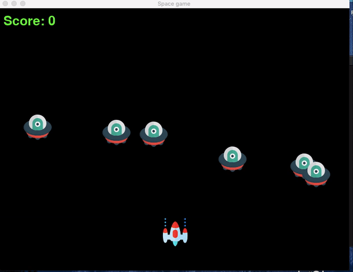

# Space Invader Game in Python

A Space Invader game developed in Python using the Pygame library. A basic implementation.

## Setup

You need to have Python installed on your system to run this game.
1. Clone this repository to your system.
2. Install Pygame (if you do not have it installed) 
   ```pip install pygame```
3. Open your Terminal and run ```python3 main.py```

## Gameplay


